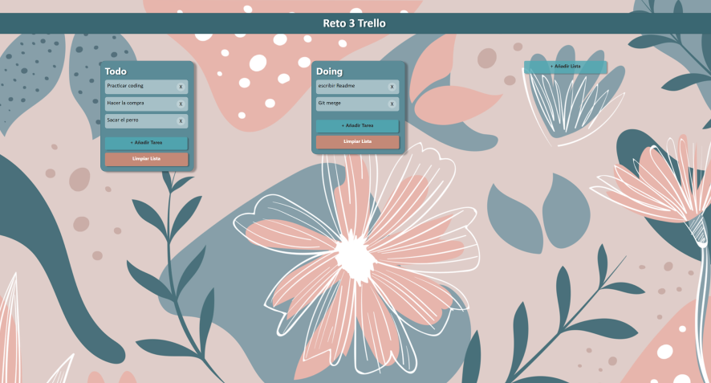

# Trello Reto3 Geek

This project is a simplified version of Trello created with educational purposes using React, Javascript and CSS.

## Getting started
-------------------

## Installacion

Use NPM in order to install everything the app needs to run correctly.

### `npm install`

## Running Project

In the project directory, you can run:

### `npm start`

Runs the app in the development mode.
Open [http://localhost:3000](http://localhost:3000) to view it in the browser.

## App information

With this aplication yo can do:
- create lists
- create tasks inside the list
- delete tasks and clear list
- organizing tasks between them and between other lists

